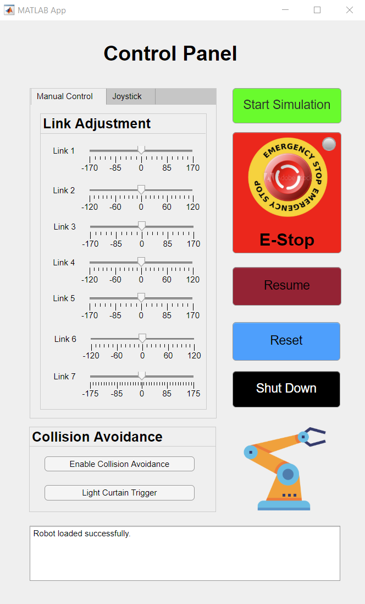

# Hoop Shooter 9000 
### 41013 Robotics - Assignment 2 ###


## Contributors: ##
* Thomas Harrison (12876785) <br/>
* Pranav Singhal (12988414) <br/>
[Origrinal Group Repository Link] https://github.com/Pranavsinghal1/hoop-shooter-9000.git

## Overview ##
The project is aimed at using KUKA LBRIIWAR800 to shoot basketballs in side the hoop. All code is MATLAB based. Everything is controlled using a GUI developed in app desigener. The project focusses on concepts like robotic arm control, trajectory planning, collision avoidance, visual servoing and simulated envisronemnet setup.

## Setup and execution ##
To run this program MATLAB is required.
1. Open ```main.m```
2. Include the code and toolbox folders in the MATLAB directory.
3. Launch the ```GUI_Control.mlapp```
4. Follow the GUI controlls to run the code.

## Demonstration ##
#### Trailer Video: [LINK](https://youtu.be/3fmOVUSD0oQ)
#### Full Video: [LINK](https://youtu.be/WoHQHrU4dg8)

## GUI Controls ##
1. Verify if robot is loaded sucessfully otherwise add relenavt files to the MATLAB directory.
* ```Start Simulation``` - begins execution
* ```Emergency Stop``` - Safety switch to hault any operation
* ```Resume``` - Starts execution where it left when E-stop or light curtains were triggered.
* ```Enable Collision Avoidance``` - A state button that enables or disables collision avoidance.
* ```Light Curtain Trigger``` - A button that mimics the sensor bein triggered when a person enters the cage, it automatically enables collision avoidance as well.
* ```Shutdown``` - exits the scripts and terminates.
* ```Link Adjustment``` - Manually change robot position by directly controlling the joints within maximum limit.
* ```Joystick``` - Control robot in X,Y,Z directions.

